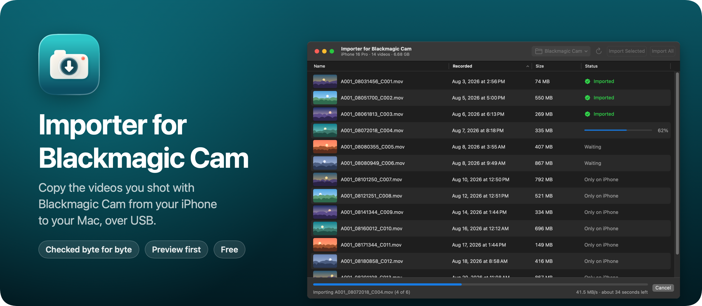
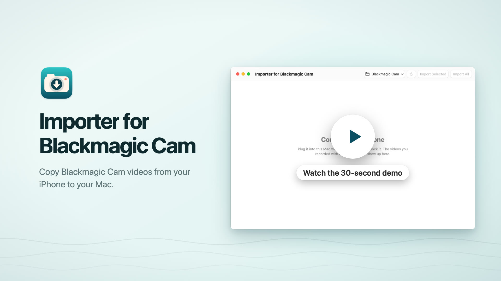
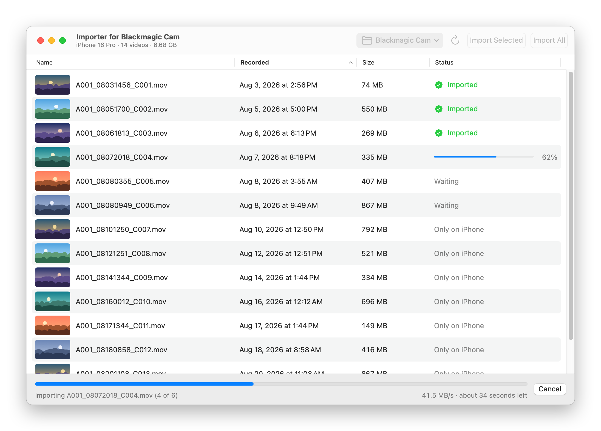

Importer for Blackmagic Camera is a free Mac app that copies the videos you record with [Blackmagic Camera](https://www.blackmagicdesign.com/products/blackmagiccamera) on your iPhone to your Mac, over a USB cable. Plug in the iPhone, see every clip with a thumbnail, play the ones you're not sure about, and import all of them or just a few.

Blackmagic Camera can save clips straight to the iPhone's photo library, but that setting never worked for me, so my clips stayed in the app's own library. Getting them out is the hard part: the clips are huge, and when you save them to the photo library by hand or export them, nothing tells you when the export has finished. The iPhone can lock itself halfway through, and you're left wondering whether your videos made it. This app shows every copy as it happens, checks each one against the iPhone's file byte for byte, and only then offers to free up the space on the iPhone.

Read the announcement and watch the 30-second demo on my blog: [I built a Mac app to import Blackmagic Camera videos from my iPhone](https://flaviocopes.com/importer-for-blackmagic-camera/).

[](https://flaviocopes.com/importer-for-blackmagic-camera/)

> Importer for Blackmagic Camera is an independent project. It's not made by, affiliated with or endorsed by Blackmagic Design. See the [disclaimer](#disclaimer).

## Download

Get `Importer-for-Blackmagic-Camera-1.2.0.zip` from the [latest release](https://github.com/flaviocopes/importer-for-blackmagic-camera/releases/latest), unzip it, and drag Importer for Blackmagic Camera to your Applications folder. It runs on macOS 15 Sequoia or later, on Apple silicon and Intel Macs.

### Opening it the first time

Importer for Blackmagic Camera is signed with my Apple Developer ID and notarized by Apple. The first time you open it, macOS asks if you're sure you want to open an app downloaded from the internet. Click **Open**.

On a work laptop you might not be able to install apps in `/Applications`. You can keep Importer for Blackmagic Camera in the `Applications` folder inside your home folder instead.

### Updates

Once a day, Importer for Blackmagic Camera asks GitHub whether there's a newer version. When there is, it shows what's new, and **Install and Relaunch** puts it in place of the old one. **Importer for Blackmagic Camera → Check for Updates…** checks right away.

To turn off the daily check, run this in Terminal:

```sh
defaults write com.flaviocopes.blackmagic-cam-importer AppUpdaterAutomaticChecks -bool false
```

## What you need

- An iPhone with Blackmagic Camera, saving its clips in the app's own storage. That's the app's folder under **On My iPhone** in the Files app. Clips saved to Photos or to an external drive don't show up.
- A USB cable between the iPhone and the Mac. Wi-Fi isn't used.
- The iPhone has to trust the Mac. If it never did, the app asks it to: unlock the iPhone, tap **Trust**, and the videos show up a moment later.

I built and tested it with an iPhone 16 Pro on iOS 26.7.1 and Blackmagic Camera 3.5.10.

## Features

- Every clip in Blackmagic Camera's Media folder, with a thumbnail, the recording date and the size. Click a column to sort by name, date or size.
- Play a clip straight from the iPhone before importing it: double-click it, or select it and press Space. Nothing is saved while you watch.
- **Import All**, or select some clips and **Import Selected**. A progress bar shows the clip being copied, the speed and the time left. The Mac stays awake until the import is done.
- Each copy is checked before it counts as imported. The app reads it back from the Mac's disk and compares its SHA-1 hash with the one the iPhone computes from its own file. A copy that doesn't match is thrown away.
- Clips already in the folder aren't copied again, only checked. The app never overwrites a file: if another file has the same name, the copy gets a new name, like `A001_02211024_C001 2.mov`.
- Copies keep the clip's recording date.
- After an import, the app asks whether to delete the imported clips from the iPhone. **Keep on iPhone** is the default button. If you choose to delete, it checks every copy again right before deleting its clip, and keeps the clip on the iPhone if anything doesn't match.
- The videos go to `~/Movies/Blackmagic Camera`, or to any folder you pick from the toolbar.
- If your iPhone has a USB 3 port (the 15 Pro and later Pro models) but the cable, port or hub only runs at USB 2 speed, a note at the bottom of the window says a USB 3 cable can make imports much faster.

<picture>
  <source media="(prefers-color-scheme: dark)" srcset="docs/screenshot-dark.png" />
  
</picture>

## Privacy

Your videos only go from the iPhone to the folder you picked. Thumbnails are cached on your Mac in `~/Library/Caches/com.flaviocopes.blackmagic-cam-importer`. Once a day, the app asks GitHub whether there's a newer version of Importer for Blackmagic Camera, and it downloads one only when you click **Install and Relaunch**. There are no accounts and no analytics.

## Build it from source

You need macOS 15 or later and Xcode 26.

Open `BlackmagicCamImporter.xcodeproj` and press `⌘R`. To build the release zip from the terminal, run:

```sh
scripts/build-release.sh
```

It builds a universal app in `build/release/Release/Importer for Blackmagic Camera.app` and zips it into `dist/`. With my Developer ID certificate in the keychain it signs and notarizes the app. Everywhere else it signs it ad hoc, so your copy is signed ad hoc. A copy you build yourself opens without a warning on your Mac.

If you send it to another Mac, macOS says it "could not verify Importer for Blackmagic Camera is free of malware". Click **Done**, then go to **System Settings → Privacy & Security** and click **Open Anyway**, or remove the quarantine flag in Terminal:

```sh
xattr -dr com.apple.quarantine "/Applications/Importer for Blackmagic Camera.app"
```

## Development

```sh
xcodegen generate                  # after editing project.yml
scripts/test.sh                    # the importer and the app model, against made-up clips
scripts/check-iphone.sh            # against a real iPhone plugged in over USB, read-only
swift scripts/render-icon.swift    # the app icon
scripts/screenshot.sh              # docs/screenshot-light.png and docs/screenshot-dark.png
swift scripts/render-banner.swift  # docs/banner.png
```

Launch the app with `--demo` to try it with made-up clips and no iPhone.

Working with an AI coding agent? Point it at [AGENTS.md](AGENTS.md). It has the commands and the rules to follow.

## How it works

The Finder can already see Blackmagic Camera's files, through Apple's MobileDevice framework. This app loads the same framework to find the iPhone on USB and open the app's Documents folder. Then it talks AFC, the iPhone's file protocol, on its own. That's what lets it ask the iPhone for the SHA-1 of a file. The iPhone computes it from its storage in about a second per gigabyte, so the check doesn't need a second download.

Previews use the same connection. AVFoundation asks for byte ranges of the clip and the app reads just those from the iPhone. Blackmagic Camera writes each clip's index at the end of the file, so a thumbnail of a 1.4 GB clip reads about 4 MB.

MobileDevice is a private framework, so a future macOS update could break the app. It's also why the app can't be on the Mac App Store.

## Disclaimer

Importer for Blackmagic Camera is an independent, unofficial project. It's not made by, affiliated with, sponsored by or endorsed by Blackmagic Design Pty. Ltd. Blackmagic Design, Blackmagic Camera and related names are trademarks of Blackmagic Design. They're used here only to say which app this one works with.

The app is provided as is, without any warranty, as the [MIT License](LICENSE) says. You use it at your own risk. I'm not responsible for lost or damaged videos, or for any damage to your iPhone, your Mac or anything else. The app checks every copy before it offers to delete anything, but keep a backup of footage you care about, and look at your copies before you delete the originals.

## License

[MIT](LICENSE)
